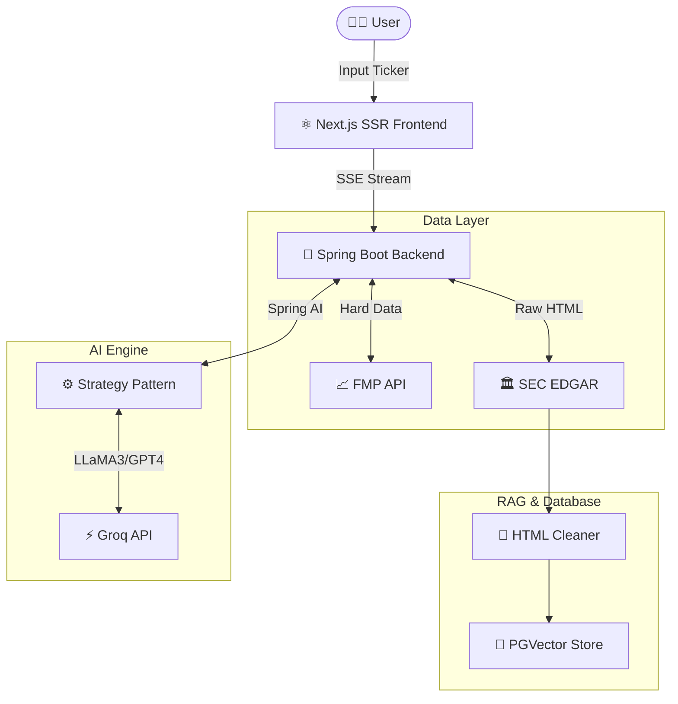

<div align="center">

# 📈 Spring Alpha (Financial AI Agent)

**Build Your Own Bloomberg Terminal with Java & AI.**

一个基于 **Spring AI** 与 **Next.js** 构建的企业级美股智能分析 Agent。
专为开发者设计的“白盒”金融分析工具，支持 BYOK (Bring Your Own Key) 模式。

[](LICENSE)
[](https://spring.io/projects/spring-boot)
[](https://nextjs.org/)
[](https://reactjs.org/)
[](https://www.docker.com/)

[**English**](./README_EN.md) | [**中文**](./README.md)

🌟 **[Live Demo 立即体验](https://spring-alpha-two.vercel.app/)** 🌟 <br>
*(基于 LLaMA 3.3 70B 模型驱动)*

</div>

---

## 🎯 为什么需要 Spring Alpha？

散户投资者面临的核心痛点是：**SEC 财报 (10-K/10-Q) 晦涩难懂且篇幅冗长**，而市面上的金融终端（如 Bloomberg）昂贵且封闭。

不同于传统的“聊天机器人”，Spring Alpha 是一套**完整的全栈 AI 金融应用**。它不仅是你的个人金融分析师，更是一个展示 **Java 在 AI 时代依然能打**的绝佳开源范例。

**核心价值**：让每位开发者都能零成本部署一个私有、免费、且强大的 AI 财富研究助手。

## ✨ 核心特性 (Features)

### 🚀 企业级 AI 架构 (Production-Ready)
*   **Model Agnostic**：基于 **Spring AI** 构建，原生支持多模型无缝切换（集成 Groq LLaMA 3.3，可极速切换 OpenAI/Gemini）。
*   **WebFlux 异步流**：全链路非阻塞 IO 处理高并发请求，结合 **SSE (Server-Sent Events)** 实现打字机级别的流式渲染体验。

### 📊 生成式金融 UI (Generative UI)
*   **AI 不止会说话，还会画图**：抛弃枯燥的纯文本 Markdown 报告，自动将大模型的数据输出渲染为 **交互式分析图表**。
*   **深度商业洞察**：内置杜邦分析法 (DuPont Analysis)、利润与营收驱动瀑布图 (Waterfall Chart) 以及财报高频词云 (Topic Word Cloud)。
*   **PDF 一键导出**：集成 `@react-pdf/renderer`，支持秒级生成「高盛研报级」精美 PDF 报告。

### 🧠 智能 RAG 与防幻觉 (Anti-Hallucination)
*   **混合事实引擎**：财报硬指标（Revenue, Net Income 等）直连 FMP API，不让 LLM 猜数字；深度解析环节从 SEC 10-K 文件实时 RAG 检索。
*   **向量检索**：集成 **PGVector** 与本地/云端 Embedding，精准提取 *MD&A*（管理层讨论）和 *Risk Factors*（风险因素）。
*   **双语交叉验证**：前端明确标识每条引用的验证状态（✅ Verified / ❌ Hallucination），构建 100% 可信的研报。

### 🐳 一键极速部署 (One-Click Deploy)
*   提供开箱即用的 `docker-compose.yml`，一键拉起后端 Spring Boot、前端 Next.js 及 PGVector 向量数据库。

---

## 🏗️ 系统架构图 (Architecture)



---

## 🛠️ 技术栈 (Tech Stack)

| 模块 | 技术选型 | 备注 |
| :--- | :--- | :--- |
| **Backend** | **Java 21**, Spring Boot 3.3, WebFlux | 使用虚拟线程与响应式编程 |
| **AI Framework** | **Spring AI** | Java 生态最主流 AI 抽象框架 |
| **Vector DB** | **PostgreSQL** + PGVector | 高性能向量近似搜索 |
| **Frontend** | **Next.js 14**, React 19, TypeScript | Server Actions 与 App Router |
| **UI Components**| **Tailwind CSS**, Shadcn UI, Recharts | 极简专业的金融终端视觉设计 |

---

## 🚀 快速开始 (Quick Start)

### 选项 A：Docker Compose 一键启动（🔥 推荐）

这是最快体验 Spring Alpha 的方式。

1. **克隆代码**
    ```bash
    git clone https://github.com/your-username/spring-alpha.git
    cd spring-alpha
    ```

2. **配置环境变量**
    复制配置文件并填入您的 API Keys：
    ```bash
    cp .env.example .env
    ```
    请在 `.env` 文件中填写：
    *   `GROQ_API_KEY`: 去 [Groq Cloud](https://console.groq.com) 免费申请。

3. **一键启动**
    ```bash
    docker-compose up -d --build
    ```
    浏览器访问 `http://localhost:3000` 即可开始分析！

### 选项 B：本地源码开发

#### 前置要求
*   Java 21+
*   Node.js 18+
*   Maven

#### 启动后端
```bash
cd backend
cp .env.example .env # 填入环境变量
./mvnw spring-boot:run
```

#### 启动前端
```bash
cd frontend
npm install
npm run dev
```

---

## 🗺️ 项目状态与 Roadmap

我们已经完成了所有的核心商业分析功能闭环。

- [x] **MVP 阶段**：跑通 Spring WebFlux + SSE + Next.js 全栈渲染链路。
- [x] **Generative UI**：基于结构化 JSON 控制前端图表（杜邦分析、瀑布桥、词云）。
- [x] **Vector RAG 注入**：PGVector 语义检索防幻觉。
- [x] **生产级部署**：Docker Compose 一键编排 & 研报 PDF 导出。
- [x] **多策略切换**：支持 Groq / OpenAI / Gemini / Mock 等策略组合。
- [wt] **Earnings Call 接入**（计划中）：分析高管 Q&A 会议音频情感分析。
- [wt] **竞争对手分析**（计划中）：横向对比多只同赛道股票指标。

---

## 🤝 贡献代码

欢迎提交 Pull Requests 做任何改进！这是一个展现 Java Web 结合现代 AI 的绝佳练兵场。
1. Fork 本仓库
2. 创建您的 Feature Branch (`git checkout -b feature/AmazingFeature`)
3. 提交您的修改 (`git commit -m 'Add some AmazingFeature'`)
4. 推送分支 (`git push origin feature/AmazingFeature`)
5. 开启一个 Pull Request

---

## 📄 开源协议 (License)

本项目基于 [MIT License](LICENSE) 协议开源，完全免费。
*Bring Your Own Key, Own Your Data.*

<div align="center">
  如果这个项目对您有帮助，请给个 ⭐️ Star 鼓励一下作者！
</div>
