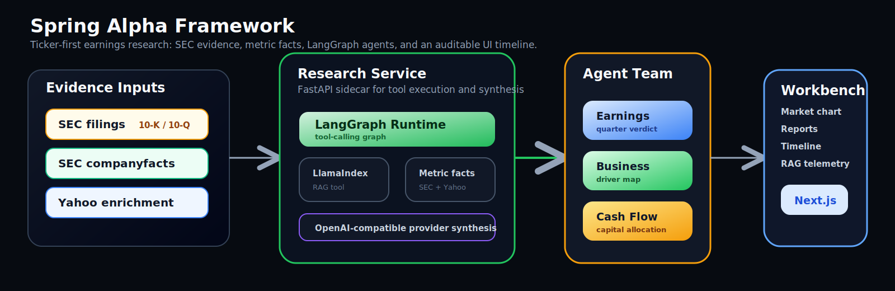
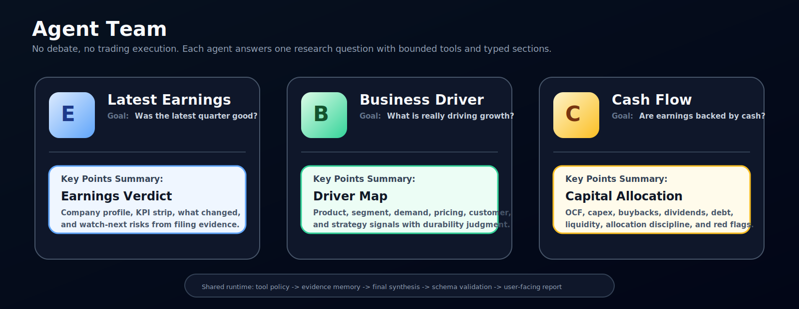
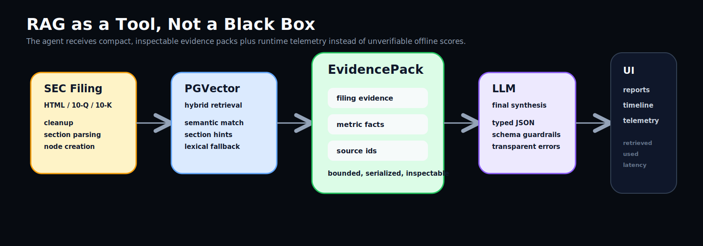
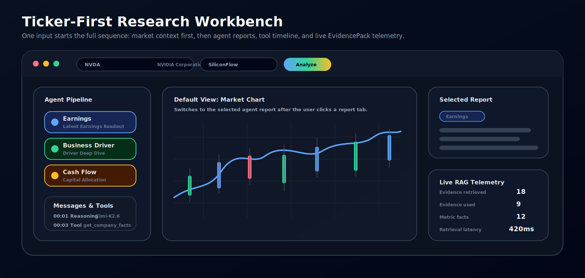

<div align="center">

# Spring Alpha: Multi-Agent Earnings Research Workbench

**一个面向美股财报研究的全栈 AI Agent 系统。**

Spring Alpha 将 **Spring Boot**, **Next.js**, **Python FastAPI Research Service**, **LangGraph/LangChain**, **LlamaIndex RAG** 和 **PGVector** 组合成一个 ticker-first 的研究工作台：输入股票代码，系统按顺序运行三个专业研究 Agent，拉取 SEC filing、财务事实和市场补充数据，最终输出可审计、结构化、可交互的财报研究报告。

[](LICENSE)
[](https://openjdk.org/)
[](https://www.python.org/)
[](https://spring.io/projects/spring-boot)
[](https://fastapi.tiangolo.com/)
[](https://nextjs.org/)
[](https://www.langchain.com/langgraph)
[](https://github.com/pgvector/pgvector)

[English](./README_EN.md) | [中文](./README.md)

</div>

---

## 最新状态

- 三条核心研究链路已经完成：Latest Earnings Readout、Business Driver Deep Dive、Cash Flow & Capital Allocation。
- Agent runtime 已升级为 LangChain/LangGraph 风格的 tool-calling graph，不再依赖旧 deterministic report fallback。
- RAG 已收缩为可控 tool：SEC filing evidence 与 SEC/Yahoo metric facts 会被组装成 EvidencePack 后交给 LLM。
- 前端已改为 ticker-first 工作台：默认展示 K 线图，用户点击左侧不同 Agent 报告后切换内容。
- `Messages & Tools` 侧边栏会按时间线展示每个 Agent 的 reasoning/tool events、模型名、token usage 和 tool input。
- RAG UI 只展示当前 run 可证明的 live telemetry，不展示离线 benchmark 分数。
- 最近一次 30 ticker 真实前后端 E2E：`30 passed (57.7m)`。

> Spring Alpha 是研究与工程演示项目，不构成投资建议。LLM 输出会受 provider、数据可用性、filing 质量和检索结果影响。

## Spring Alpha 架构

Spring Alpha 的设计借鉴真实投研团队的分工，但不做 debate，也不做自动交易。系统将一个复杂的财报研究任务拆成三个专业 Agent，每个 Agent 都有自己的问题定义、工具集合、证据上下文和 typed report schema。

<p align="center">
  
</p>

### Agent 团队

<p align="center">
  
</p>

#### 1. Latest Earnings Readout

回答“这家公司最新一季到底好不好”。它关注公司简介、财报判断、关键 KPI、季度变化和下一步观察项。

主要输出：

- Company Profile
- Earnings Verdict
- KPI Strip
- What Changed
- Watch Next

#### 2. Business Driver Deep Dive

回答“业务表现由什么驱动，以及这些驱动是否可持续”。它把证据拆到 product、segment、geography、demand、pricing、customer、strategy 等视角。

主要输出：

- Thesis
- Driver Map
- Impact Table
- Signals
- Watchlist

#### 3. Cash Flow & Capital Allocation

回答“利润是否有现金支持，资本配置是否健康”。它关注 operating cash flow、capex、buybacks、dividends、debt、liquidity 和 red flags。

主要输出：

- Cash Quality
- Cash Flow Bridge
- Capital Allocation Scorecard
- Allocation Discipline
- Red Flags

## 证据与 RAG 设计

Spring Alpha 不把 RAG 做成一个沉重的黑盒。RAG 是 Agent 可以调用的工具，负责把 SEC filing 中的相关段落整理成 EvidencePack。

<p align="center">
  
</p>

当前证据链路如上图所示：SEC filing 经过清洗、section parsing、LlamaIndex node 构建和 PGVector 检索后，与 SEC/Yahoo metric facts 一起进入 EvidencePack，再交给 LLM 做最终结构化合成。

前端 RAG 面板只展示当前 run 的真实 telemetry：

- Evidence Retrieved
- Evidence Used
- Metric Facts
- Sections Covered
- Retrieval Latency
- Empty Retrieval
- Evidence Pack Size

离线评测指标，如 Recall@5、Context Precision、Section Accuracy，属于 regression suite，不会伪装成当前 ticker 的实时质量分数。

## 产品体验

用户只需要输入 ticker，然后点击 Analyze。系统会：

1. 拉取 K 线图并默认展示 Market Chart。
2. 按顺序运行三个 Agent。
3. 左侧显示每个 Agent 的完成状态。
4. `Messages & Tools` 展示 Agent 时间线。
5. 用户点击任意 Agent 报告查看对应研究内容。
6. Developer diagnostics 中显示当前 run 的 RAG telemetry。

<p align="center">
  
</p>

## 安装与本地开发

### 前置依赖

- Java 21+
- Node.js 20+
- Maven 或 `backend/mvnw`
- Docker Desktop 或 OrbStack
- Python 研究服务使用 `uv`

### 克隆项目

```bash
git clone https://github.com/your-org/spring-alpha.git
cd spring-alpha
```

### 环境变量

复制示例环境文件，并填入你自己的 provider key：

```bash
cp .env.example .env
```

常用变量：

```bash
SILICONFLOW_API_KEY=sk-...
SILICONFLOW_MODEL=Pro/moonshotai/Kimi-K2.6
OPENAI_API_KEY=sk-...
GEMINI_API_KEY=...
SPRING_DATASOURCE_URL=jdbc:postgresql://aws-0-ap-southeast-2.pooler.supabase.com:5432/postgres?sslmode=require
SPRING_DATASOURCE_USERNAME=postgres.your-project-ref
SPRING_DATASOURCE_PASSWORD=your-supabase-db-password
SPRING_JPA_HIBERNATE_DDL_AUTO=update
RAG_EMBEDDING_PROVIDER=gemini
RAG_VECTOR_STORE_PROVIDER=qdrant
QDRANT_URL=https://your-cluster.region.aws.cloud.qdrant.io
QDRANT_API_KEY=your-qdrant-api-key
QDRANT_COLLECTION=spring_alpha_rag_chunks
RAG_EMBEDDING_DIMENSION=3072
```

本地手动测试时，前端也支持 BYOK。你可以直接在浏览器里粘贴 provider key；它会存到 localStorage，并随分析请求转发给后端。

不要把真实的 provider key、Qdrant API key、数据库密码写进 Git 仓库。Render / Vercel / 本地 `.env` 才是这些 secret 的位置。

线上部署推荐把职责拆开：

- Supabase Free Postgres：Spring Boot 的关系型元数据和 JPA 表。
- Qdrant Cloud Free：SEC chunk embedding 和向量召回。
- Render：Spring Boot backend + Python Research Service 的运行时环境变量。
- Vercel：Next.js frontend，只配置后端 API 地址，不放数据库密码。

Render 后端服务使用 Supabase Supavisor session pooler：

```bash
SPRING_PROFILES_ACTIVE=prod
SPRING_DATASOURCE_URL=jdbc:postgresql://aws-0-ap-southeast-2.pooler.supabase.com:5432/postgres?sslmode=require
SPRING_DATASOURCE_USERNAME=postgres.your-project-ref
SPRING_DATASOURCE_PASSWORD=your-supabase-db-password
SPRING_JPA_HIBERNATE_DDL_AUTO=update
```

Render Python Research Service 使用 Qdrant：

```bash
RAG_VECTOR_STORE_PROVIDER=qdrant
QDRANT_URL=https://your-cluster.region.aws.cloud.qdrant.io
QDRANT_API_KEY=your-qdrant-api-key
QDRANT_COLLECTION=spring_alpha_rag_chunks
RAG_EMBEDDING_PROVIDER=gemini
RAG_EMBEDDING_DIMENSION=3072
```

### 启动后端栈

推荐使用本地脚本启动：

```bash
/usr/bin/env bash scripts/start-backend-stack.sh
```

它会启动：

- PGVector：`127.0.0.1:5433`
- Python Research Service：`127.0.0.1:8090`
- Spring Boot backend：`127.0.0.1:8082`

### 启动前端

```bash
cd frontend
npm install
BACKEND_URL=http://127.0.0.1:8082 npm run dev -- --hostname 127.0.0.1 --port 3001
```

打开：

```text
http://127.0.0.1:3001/app
```

### Docker Compose

```bash
cp .env.example .env
docker compose up -d --build
```

Compose 会启动 PGVector、Research Service、Spring Boot backend 和 Next.js frontend。Compose 模式下 backend 在 Docker 网络内使用 `8081`；本地脚本模式使用 `8082`，避免和其他服务冲突。

## Provider 支持

运行时使用 OpenAI-compatible LLM gateway。当前 UI 支持的 provider：

| Provider | 默认模型路径 | 说明 |
| --- | --- | --- |
| SiliconFlow | `Pro/moonshotai/Kimi-K2.6` | 当前主要真实 E2E provider |
| OpenAI | `gpt-4o-mini` by env default | OpenAI-compatible 路径 |
| Gemini | `gemini-2.5-pro` by env default | 通过 OpenAI-compatible endpoint 调用 |

SiliconFlow 当前重点适配过：

- `Pro/moonshotai/Kimi-K2.6`
- `deepseek-ai/DeepSeek-V4-Flash`

Kimi K2.6 目前是完整 agent E2E 中质量和稳定性更优先的模型。

## 项目结构

```text
spring-alpha/
  backend/                         Spring Boot API, SEC/Yahoo boundary, SSE contract
  frontend/                        Next.js research workbench
  src/research-service/            FastAPI + LangGraph + LlamaIndex RAG sidecar
  scripts/                         local stack and verification scripts
  docs/                            architecture notes and task contracts
  docker-compose.yml               PGVector + research service + backend + frontend
```

关键文件：

```text
frontend/src/components/app/earnings-analyst-app.tsx
frontend/src/components/app/rag-eval-dashboard.tsx
frontend/src/app/api/sec/analyze/[ticker]/route.ts
backend/src/main/java/com/springalpha/backend/service/FinancialAnalysisService.java
backend/src/main/java/com/springalpha/backend/service/research/ResearchAgentReportMapper.java
src/research-service/app/agents/research_workflow.py
src/research-service/app/agents/tool_calling_graph.py
src/research-service/app/rag/llamaindex_pipeline.py
```

## 测试

### 前端单元测试

```bash
cd frontend
npm test
```

### 前端 E2E

```bash
cd frontend
npm run test:e2e
```

### Research Service 测试

```bash
cd src/research-service
uv run pytest
```

### 后端测试

```bash
cd backend
./mvnw test
```

### 真实 provider 验证

这些测试会调用外部 provider，建议手动运行：

```bash
PROVIDER=siliconflow SILICONFLOW_API_KEY="$SILICONFLOW_API_KEY" \
  scripts/verify-provider-tool-e2e.sh
```

如果要做完整前后端人工验证，先启动后端栈和前端，再使用你的 provider key 对本地 app 跑 Playwright。

## 当前边界

- 这不是交易机器人，也不会下单。
- 系统不会暴露隐藏 chain-of-thought；它只展示结构化 agent events、tool names、usage 和 latency。
- 当 SEC companyfacts 缺少 gross margin、capex、buybacks 等特定指标时，部分 ticker 可能显示 `LIMITED` source context。
- Provider 延迟和 rate limit 会影响真实运行。
- RAG telemetry 是运行时可观测性指标，不是在线准确率或召回率分数。

## 路线图

- 提升非标准财报行业的 metric facts 覆盖。
- 增强 company profile 和 segment KPI 抽取。
- 增加可选的 earnings call transcript tools。
- 增加持久化 run archive 和可回放 agent timeline。
- 扩展 RAG 与 report quality 的 benchmark suite。

## 参与贡献

欢迎提交 issue 和 pull request。当前最有价值的贡献方向：

- 更好的 SEC filing section parsing
- 更稳健的 metric normalization
- Provider compatibility 改进
- 面向高密度金融工作流的 UI polish
- RAG evaluation dataset 与 edge cases

## 鸣谢

Spring Alpha 的多 Agent 研究工作流，受到 [TauricResearch/TradingAgents](https://github.com/TauricResearch/TradingAgents)的启发。

TradingAgents 展示了如何把复杂金融研究任务拆给多个专业 Agent，并以清晰的工具调用轨迹呈现推理过程。Spring Alpha 在此基础上选择了不同的产品边界：专注美股财报阅读、SEC filing evidence、metric facts、EvidencePack RAG 和可审计的研究报告，不包含 debate、portfolio management 或自动交易执行。

## 许可证

本项目使用 MIT License 发布。
