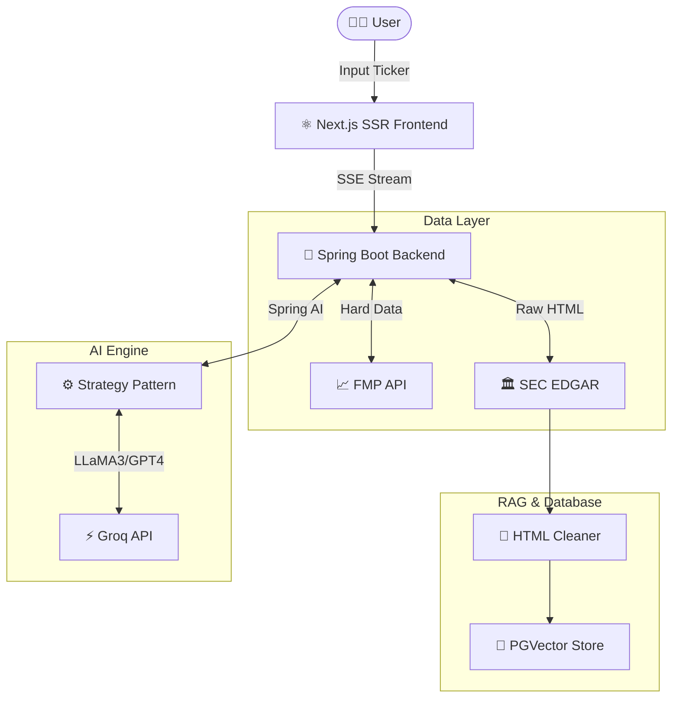

<div align="center">

# 📈 Spring Alpha (Financial AI Agent)

**Build Your Own Bloomberg Terminal with Java & AI.**

An enterprise-grade US stock analysis agent built with **Spring AI** and **Next.js**.
A "white-box" financial analysis tool designed for developers, fully supporting BYOK (Bring Your Own Key) mode.

[](LICENSE)
[](https://spring.io/projects/spring-boot)
[](https://nextjs.org/)
[](https://reactjs.org/)
[](https://www.docker.com/)

[**English**](./README_EN.md) | [**中文**](./README.md)

🌟 **[Live Demo](https://spring-alpha-two.vercel.app/)** 🌟 <br>
*(Powered by LLaMA 3.3 70B)*

</div>

---

## 🎯 Why Spring Alpha?

The core pain point for retail investors is that **SEC financial reports (10-K/10-Q) are obscure, lengthy, and difficult to read**, while professional financial terminals (like Bloomberg) are incredibly expensive and closed-source.

Unlike traditional "chatbots", Spring Alpha is a **complete full-stack AI financial application**. It is not only your personal financial analyst but also an excellent open-source paradigm demonstrating that **Java is still a beast in the AI era**.

**Core Value**: Empowering every developer to deploy a private, free, and powerful AI wealth research assistant at zero cost.

## ✨ Key Features

### 🚀 Enterprise-Grade AI Architecture (Production-Ready)
*   **Two-Path Model Access**: Ships with free hosted models by default (Groq / ChatAnywhere) and also supports user-provided **OpenAI API keys** for official OpenAI models.
*   **WebFlux Async Streaming**: Full-chain non-blocking IO handles high-concurrency requests, combined with **SSE (Server-Sent Events)** for a typewriter-like streaming rendering experience.

### 📊 Generative Financial UI (Generative UI)
*   **AI That Draws, Not Just Talks**: Ditching boring plain text Markdown reports, the system automatically renders the LLM's structured data output into **interactive analysis charts**.
*   **Deep Business Insights**: Built-in feature sets include DuPont Analysis, Profit & Revenue Driver Waterfall Charts, and Financial Report Topic Word Clouds.
*   **One-Click PDF Export**: Integrated with `@react-pdf/renderer`, supporting the generation of "Goldman Sachs level" exquisite PDF reports in seconds.

### 🧠 Smart RAG & Anti-Hallucination
*   **Hybrid Fact Engine**: Hard financial metrics (Revenue, Net Income, etc.) are directly pulled from the FMP API—LLMs are never allowed to guess numbers. For deep analysis, text is retrieved real-time from SEC 10-K filings using RAG.
*   **Vector Retrieval**: Integrated with **PGVector** and local/cloud embeddings to accurately extract *MD&A* (Management's Discussion and Analysis) and *Risk Factors* sections.
*   **Cross-Verification**: The frontend clearly identifies the verification status of every citation (✅ Verified / ❌ Hallucination), building 100% trustworthy research reports.

### 🐳 One-Click Ultra-Fast Deployment (One-Click Deploy)
*   Provides an out-of-the-box `docker-compose.yml` to instantly spin up the Spring Boot backend, Next.js frontend, and PGVector database with a single command.

---

## 🏗️ System Architecture



---

## 🛠️ Tech Stack

| Module | Technology Selection | Notes |
| :--- | :--- | :--- |
| **Backend** | **Java 21**, Spring Boot 3.3, WebFlux | Utilities Virtual Threads & Reactive Programming |
| **AI Framework** | **Spring AI** | The most mainstream AI abstraction framework in the Java ecosystem |
| **Vector DB** | **PostgreSQL** + PGVector | High-performance vector approximate nearest neighbor search |
| **Frontend** | **Next.js 14**, React 19, TypeScript | Server Actions & App Router |
| **UI Components**| **Tailwind CSS**, Shadcn UI, Recharts | Minimalist and professional financial terminal visual design |

---

## 🚀 Quick Start

### Option A: Docker Compose One-Click Start (🔥 Recommended)

This is the fastest way to experience Spring Alpha.

1. **Clone the code**
    ```bash
    git clone https://github.com/your-username/spring-alpha.git
    cd spring-alpha
    ```

2. **Configure Environment Variables**
    Copy the configuration file and fill in your API Keys:
    ```bash
    cp .env.example .env
    ```
    Please fill in the `.env` file:
    *   `GROQ_API_KEY`: Apply for free at [Groq Cloud](https://console.groq.com).

3. **One-Click Start**
    ```bash
    docker-compose up -d --build
    ```
    Access `http://localhost:3000` via your browser to start analyzing!

### Option B: Local Source Code Development

#### Prerequisites
*   Java 21+
*   Node.js 18+
*   Maven

#### Start Backend
```bash
cd backend
cp .env.example .env # Fill in env vars
./mvnw spring-boot:run
```

#### Start Frontend
```bash
cd frontend
npm install
npm run dev
```

---

## 🗺️ Project Status & Roadmap

We have completed the closed loop of all core business analysis functions.

- [x] **MVP Phase**: Successfully ran through the Spring WebFlux + SSE + Next.js full-stack rendering pipeline.
- [x] **Generative UI**: Frontend chart control based on structured JSON (DuPont analysis, waterfall bridge, word cloud).
- [x] **Vector RAG Injection**: PGVector semantic retrieval for anti-hallucination.
- [x] **Production Deployment**: Docker Compose one-click orchestration & Research Report PDF export.
- [x] **Multi-Strategy Switching**: Support for free hosted models (Groq / ChatAnywhere) plus user-provided OpenAI keys.
- [wt] **Earnings Call Integration** (Planned): Analyzing executive Q&A audio emotion analysis.
- [wt] **Competitor Analysis** (Planned): Horizontal comparison of multiple stock indicators in the same sector.

---

## 🤝 Contributing

Pull Requests for any improvements are highly welcome! This is an excellent training ground to showcase modern Java Web combined with AI.
1. Fork the repository
2. Create your Feature Branch (`git checkout -b feature/AmazingFeature`)
3. Commit your changes (`git commit -m 'Add some AmazingFeature'`)
4. Push to the Branch (`git push origin feature/AmazingFeature`)
5. Open a Pull Request

---

## 📄 License

This project is open-sourced under the [MIT License](LICENSE), completely free.
*Bring Your Own Key, Own Your Data.*

<div align="center">
  If you find this project helpful, please give it a ⭐️ Star to encourage the author!
</div>
